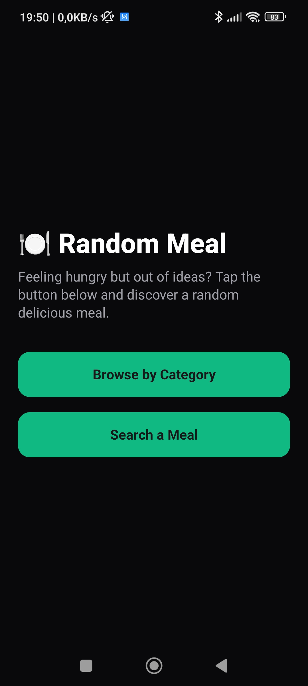
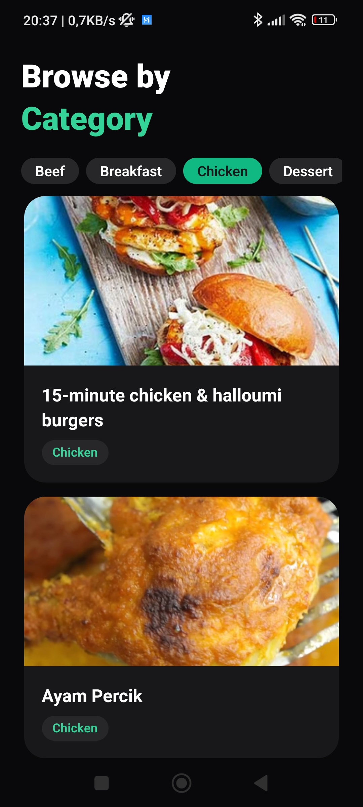
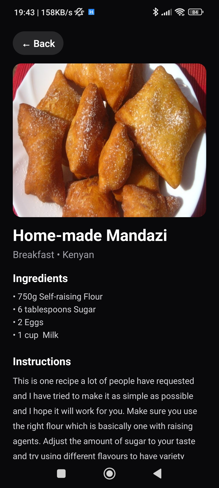

# Meal Generator 🍽️

A mobile app built with **React Native + Expo + TypeScript** that lets you discover random meals, filter by category, and search for specific recipes using [TheMealDB API](https://www.themealdb.com/api.php).  

---

## Features

- Generate a **random meal** with full details.
- **Filter meals** by category (e.g., Vegan, Seafood, Meat).  
- **Search meals** by name.  
- View **ingredients, instructions, and YouTube videos** for each meal.  
- Modern, responsive **UI with NativeWind (Tailwind CSS)**.  
- Optimized for smooth scrolling with many meals.  

---

## Screenshots





---

## Installation

1. Clone the repository:

```bash
git clone https://github.com/yourusername/meal-generator.git
cd meal-generator
npm install
```

1. Start the Expo development server:

```bash
npx expo start
```

## Build APK (Android)

1. Install EAS CLI if you haven’t already:

```bash
npm install -g eas-cli
```

1. Log in to your Expo account:

```bash
eas login
```

1. Configure your project for EAS builds:

```bash
eas build:configure
```

1. Build the APK:

```bash
eas build --platform android --profile production
```

1. Once the build is complete, download the APK from the provided link.

## LICENSE

This project is licensed under the MIT License. See the [LICENSE](LICENSE) file for details.
