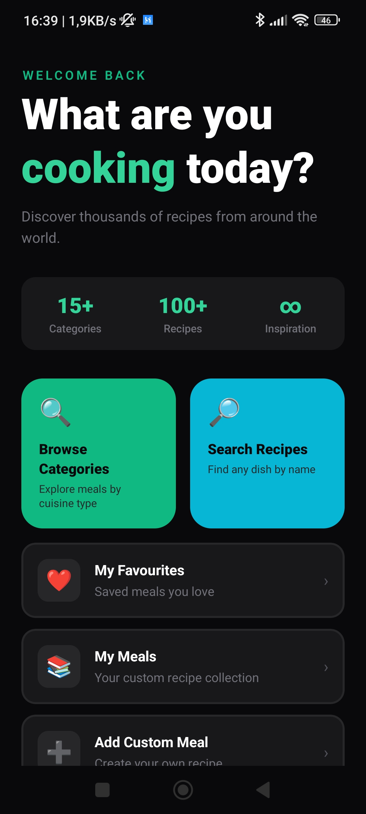
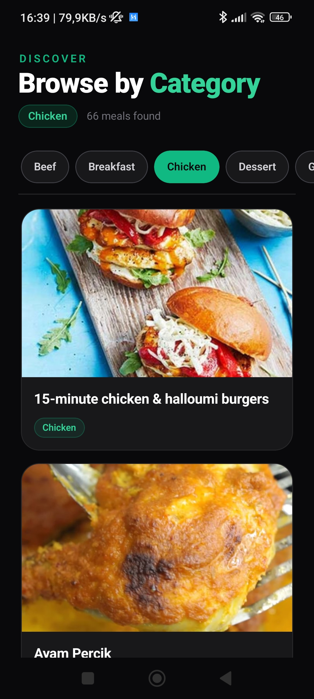
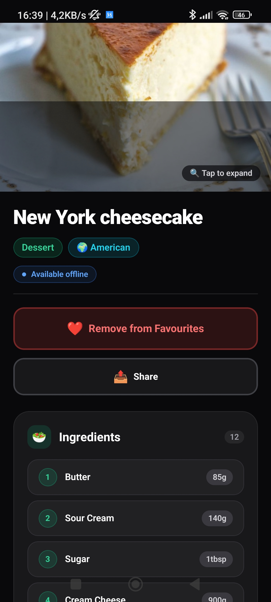
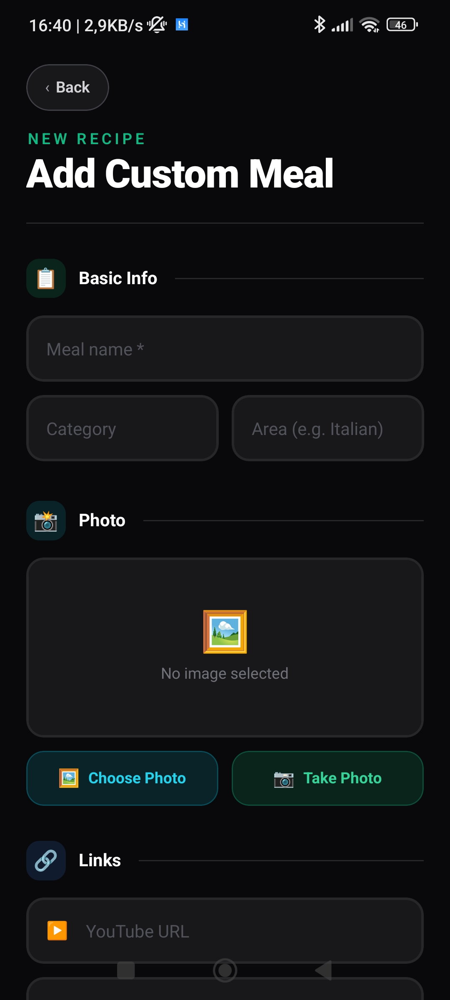

# Meal Generator 🍽️

A mobile app built with **React Native + Expo + TypeScript** that lets you discover random meals, filter by category, and search for specific recipes using [TheMealDB API](https://www.themealdb.com/api.php).


---

## Features

- 🎲 **Surprise Me!** — Fetch a completely random meal with one tap from the home screen.
- 🔍 **Browse by Category** — Explore meals filtered by cuisine type.
- 🌍 **Browse by Cuisine** — Filter meals by country/area using the tab switcher in the Browse screen.
- 🔎 **Search Recipes** — Find any dish by name with live results.
- ❤️ **Favourites** — Save meals locally and access them anytime, even offline.
- 🕐 **Recently Viewed** — Quick access to the last meals you opened.
- 📅 **Meal Planner** — Assign breakfast, lunch, and dinner to each day of the week from your favourites.
- 🛒 **Shopping List** — Auto-generate a grocery list from your saved meals; check off items as you shop.
- 🗒️ **Personal Notes** — Write and save a private note on any meal, editable and deletable at any time.
- 📊 **Your Kitchen** — Stats overview showing favourites, custom meals, planner progress, shopping list completion, notes, and offline cache.
- 📚 **Custom Meals** — Create, edit, and delete your own recipes with photo support.
- 📶 **Offline Support** — Cached meals are available without a network connection.
- 💀 **Skeleton loaders** — Smooth loading placeholders throughout the app.
- 📺 **YouTube & Source links** — Watch video walkthroughs or visit the original recipe source.
- 📤 **Share meals** — Share any recipe via the native share menu.
- 🎨 **Modern UI** — Dark-themed, responsive design powered by NativeWind (Tailwind CSS).
- ⚡ **Optimised lists** — Windowed rendering for large meal collections.

---

## Screenshots






---

## Installation

1. Clone the repository:

```bash
git clone https://github.com/yourusername/meal-generator.git
cd meal-generator
npm install
```

1. Start the Expo development server:

```bash
npx expo start
```

## Build APK (Android)

1. Install EAS CLI if you haven’t already:

```bash
npm install -g eas-cli
```

1. Log in to your Expo account:

```bash
eas login
```

1. Configure your project for EAS builds:

```bash
eas build:configure
```

1. Build the APK:

```bash
eas build --platform android --profile production
```

1. Once the build is complete, download the APK from the provided link.

## LICENSE

This project is licensed under the MIT License. See the [LICENSE](LICENSE) file for details.
